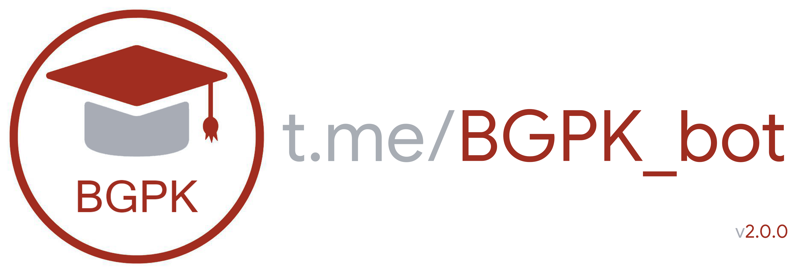

## Getting started

BGPK bot - telegram bot for Polytechnic College which provides convenience way viewing schedule and replacements (changes in schedule)

* Username: @BGPK_bot

* Or you can use this [link](https://t.me/BGPK_bot)

## Functionality
* __Schedule__
- [x] today/tomorrow schedule
- [x] all week schedule
- [x] next week schedule
- [x] educators schedule
- [x] automatic dispatch of the schedule for the next day (at a certain time)
* __Replacements__
- [x] today/tomorrow replacements
- [x] all week replacements
- [x] replacement for a specific group/course/division
- [x] automatic dispatch of replacements after publication on the site
* __Rings__
- [x] schedule of calls for the nearest academic year
- [x] nearest-bell function
* __Settings__
- [x] notifications
- [x] change group
- [x] complete the work (exit)
* __Info__
- [x] briefly info
- [x] full info
* __Rate__
- [x] rate bot
- [x] average rate
- [x] callback

## Special thanks
1. [@eternnoir](https://github.com/eternnoir) for [pyTelegramBotAPI](https://github.com/eternnoir/pyTelegramBotAPI)
2. [@EeOneDown](https://github.com/EeOneDown) for [Spbu4UBot](https://github.com/EeOneDown/spbu4u)
3. [pythonanywhere](https://www.pythonanywhere.com) for free hosting
4. You
